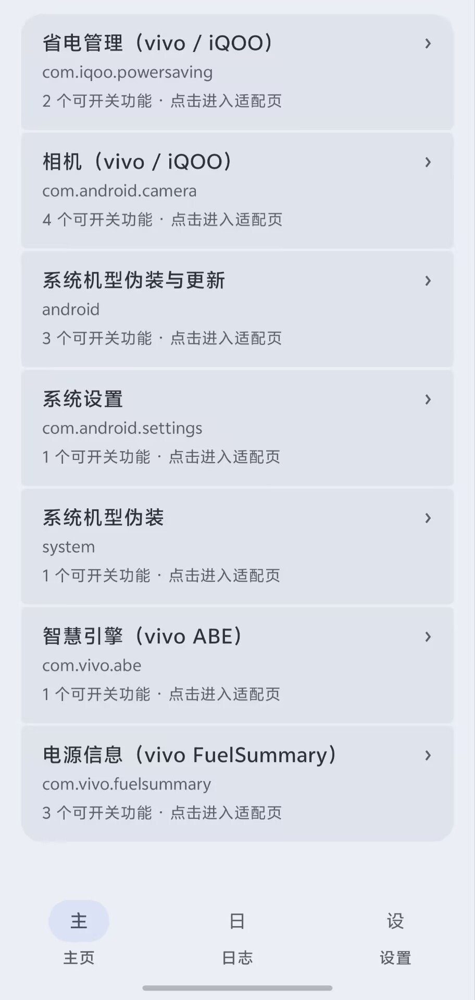
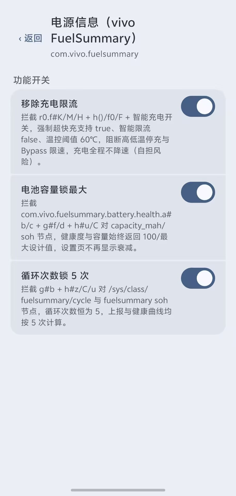

# 灵犀Hook

> 基于 libxposed 102 现代 API 的 vivo / iQOO 系统补丁，跑在 OriginOS 上，拦截系统按机型阉割的判定，把被隐藏的入口与能力放开。当前已覆盖 **省电管理、相机（ZEISS 水印/图标/校园/高像素）、机型伪装、智慧引擎 ABE 自动重启屏蔽、电源信息 FuelSummary 充电/容量/循环、远程更新**，后续按需扩展至更多系统模块。

| 事项 | 说明 |
|---|---|
| 包名 | `github.boxiaolanya2008.lingxihook` |
| 最低 SDK | 33（miuix-blur 强制），目标 37，AGP 9.3.1，Kotlin 2.4.10 |
| 框架 | LSPosed / LSPatch 等支持 libxposed 101+ 的实现 |
| UI | Compose BOM 2026.02.01 + Material 3 1.5 Expressive + materialkolor 4.1.1 + miuix-blur 0.9.3（液态玻璃导航） |
| 版本 | `3` `1.3.0`（`update.json` 远程可控，`force_update` 区分强制/可稍后） |

## 实机演示

> V2520A OriginOS 真机，LSPosed 已勾选对应作用域

| 主页·已适配 | 详情页·水印/充电 |
|---|---|
|  |  |

## 已适配

- **省电管理（vivo / iQOO）`com.iqoo.powersaving`**
  - **无线充电适配**（`HookFeature` `lingxi_hook_wireless`，默认开）：Hook `com.iqoo.powersaving.utils.g#E` / `#F(Context)` 强制 `true`，放行 `persist.vivo.wireless_charge_support` 与 `wireless_position_support` 判断，恢复设置页“反向无线充电”“无线充电摆放位置”两项。
  - **关闭应用深度优化**（`lingxi_hook_deepopt`，默认开）：Hook `appoptimize.b/d#startDexoptJob` 返回 `false`、`getDexoptPackages` 空列表、`getPredictDexoptTime` 0、`getRunningStatus` `OPTIMIZED_MANUAL`，阻断后台 dexopt 调度与“一键优化”按钮。
- **相机（vivo / iQOO）`com.android.camera`**
  - **ZEISS 水印解锁**（`HookFeature` `lingxi_hook_camera_zeiss`，默认开）：Hook `featureconfig.FeatureConfig_common#isCameraSignedByZeiss/isSupportWatermarkZEISS/isSupportWatermarkBorder/isSupportZeissColor` 强制 `true`，`supportWatermarkTmpl` 反射取 `WMTmplID` 全量（含 `BORDER_PHOTO_AURALIGHT/BORDER_PHOTO_AURALIGHT_V/MASTER_PHOTO_AURALIGHT_V` 等 AURA LIGHT 变体）并把 `getWatermarkVersion` 抬至 `V4`，`StandardSizeConfig#isIqooLogoName -> false` 与 `DeviceUtil#isIQOO`（仅水印栈）`-> false`；同时伪装机型为 `vivo X500 BETA`（`Build.MODEL/PRODUCT/DEVICE`、`SystemProperties ro.product.model.bbk/ro.vivo.market.name/ro.vivo.product.series=X/platform=MT6991`、`FeatureConfig#getMarketName/getVivoLogoName/productSeries`、`WatermarkUtils#generateLogoText` 全量拦截，`productBatchTime=20250930`），摄像参数对齐 `vivo X300 Pro`（天玑 9400 MT6991 旗舰），使 iQOO 成片 EXIF 与边框水印均落盘 `ZEISS` 联名图标与 `vivo X500 BETA | ZEISS` 落款。
  - **水印图标全显**（`HookFeature` `lingxi_hook_camera_icons`，默认开）：Hook `FeatureConfig_common#isSupportShowWatermarkIcon -> true` 放行图标栏，拦截所有 `WMTemplate.WMItem/RelatedWMItem` 构造器把 `unShowList` 清空为 `HashSet(0)` 并 `show=true`，`getIQOOBorderWatermarkImageVersion->2` 与 `getIQOOBorderWatermarkImageOrder->[threecolor_logo/iqoo_logo/kpl_logo]` 补全 IQOO 三图标，并反射补丁已建好的 `gk/j` 静态池 `Map<String,WMTemplate>` 中全部 `unShowList`；对原缺 `LOGO_PIC` 的 `BORDER_PHOTO / BORDER_PHOTO_AURALIGHT` 动态注入 `R.array.pref_camera_watermark_boder_logo_pics` 的 `WMItem(LOGO_PIC, pref_camera_water_mark_logo_pic)`，使**边框水印**页（如图圈选的 `AURA LIGHT` 圆形徽标）新增可横滑的**水印图标**选择器，支持在 `ZEISS / vivo / AURA LIGHT / KPL` 等全部官方图标间切换，不再按机型阉割。
  - **校园水印修复**（`HookFeature` `lingxi_hook_camera_campus`，默认开）：Hook `ISettingManager#getSettingValueFromKey(pref_camera_watermark_graduate_school)` 空/`normal`/`7` 回退为 `浙江大学`，并拦截 `oi/f#beforeOnItemClick` 对 `GRADUATE_SCHOOL` 模板自动写入默认学校绕过空学校弹窗，使校园水印（华中科大/浙大）选择后可直接出片并正常落盘边框、校徽与口号。
  - **高像素解锁 50M→200M**（`HookFeature` `lingxi_hook_camera_highpixel`，默认开）：Hook `FeatureConfig#getSupportRemosaicValue(Master 32→200/Wide 32→50/Tele 32→100)` 与 `isSupport200MP/isSupportPhotoHighResolution` 全量 `true`，并拦截 `CameraCharacteristics#get(SENSOR_INFO_PIXEL_ARRAY_SIZE)` 与 `ISettingManager` 持久化键 `remosaic/high/pixel`，使 V2520A 原 50M 主摄在“高像素”中出现 100M/200M 档位且重启后仍为 200M，取景器切到 200M 后按 `SENSOR_PIXEL_MODE` 打包落盘。
- **机型伪装（系统）`android / system / com.android.settings`**
  - **PD2520→PD2502 / V2520A→V2502A**（`HookFeature` `lingxi_hook_device_model`，默认开）：Hook `Build` 与双 `SystemProperties#get` 对 `PD2520/V2520A` 的返回值 `replace→PD2502/V2502A`，使全系统（含相机 FeatureConfig 选型）识别为 `PD2502`。
  - **真实电量（系统）`android`**（`lingxi_hook_real_battery`，默认开）：Hook `system_server BatteryService` 派发 `level` 使首格不再 30~60m 后暴跌，`UI=FG raw_soc` 均匀 10m/格（刷视频）/5m（MOBA），已在 `DeviceModelHook.kt:28 + BatteryRealHook.kt:14` 实现。
- **系统设置 `com.android.settings`**
  - **机型伪装**（`HookFeature` `lingxi_hook_device_model` 同系统）：`com.android.settings` 进程内同样拦截型号读取，使设置页关于手机中型号显示为 `PD2502`。
- **系统更新屏蔽（手动）`android`**
  - **屏蔽系统更新**（`HookFeature` `lingxi_hook_block_update`，默认关）：不自动 Hook，需 ROOT 手动执行更新页提示的 `setprop` 命令，开关仅作入口与 Root 检测提示。
- **智慧引擎（vivo ABE / Smart Engine）`com.vivo.abe`**
  - **屏蔽自动重启**（`HookFeature` `lingxi_hook_abe_silent_reboot`，默认开）：Hook `com.vivo.silentreboot.SilentRebootService#p0/o0/g0/v0/n0/Z` 阻断 02:00-04:00 夜间静默重启调度与 `AlarmManager.setExactAndAllowWhileIdle`，并拦截 `android.os.PowerManager#reboot(silent/reboot)` 与 `e4.a#i() sysrb` 策略重启，`com.vivo.abe` 进程内直接 `PROTECTIVE` 拦截不执行，需 LSPosed 勾选 `com.vivo.abe`。系统应用名称显示为“智慧引擎”。
- **电源信息（vivo FuelSummary）`com.vivo.fuelsummary`**
  - **移除充电限流**（`lingxi_hook_fuel_charging_unlimit`，默认开）：Hook `r0.f#K/M/H + h()/f0/F + y/z + 电流温控` 强制超快充支持 `true`、智能限流 `false`、温控阈值 `42→60℃` 并过滤 `h#r/L` 的 `fex_* / fix_temp` 限流写入，全程不降速（风险自担）。
  - **电池容量锁最大**（`lingxi_hook_fuel_capacity_max`，默认开）：Hook `battery.health.a#b/c + g#f/d + h#u/m/C` 对 `capacity_mah/soh` 节点强制 `100`，健康度与容量始终显示满血。
  - **循环次数锁 5 次**（`lingxi_hook_fuel_cycle_5`，默认开）：Hook `g#b + h#z/C/u/m` 对 `/sys/class/fuelsummary/cycle` 强制 `5`，健康曲线按 5 次计算。
- **远程更新** `update.json`（`Gitee raw` 无缓存）
  - 5 标识 `versionCode / versionName / force_update / download_url / changelog`，`UpdateChecker.kt:19` 每次 `?t=` + `no-cache/no-store` 强制走网络，`force_update=true` 时弹窗无“下次再说”且不可取消，`false` 时可稍后。

开关写入 `Settings.System` 镜像，`HookConfig` 在目标进程实时读取，不需重启；未授予“修改系统设置”时按默认值生效。`HookLogger` 统一打 `LingXiHook` 到 logcat，自身直写 `filesDir/logs/lingxi.log`，目标进程优先直写 `/data/local/tmp/lingxihook.log`（`world-writable` 绕广播限）失败再广播 `LogReceiver`，`LogRepo` 合并双文件，日志页 2s 自动刷新可筛 `INFO/WARN/ERROR`，`[abe]`/`[fuel]`/`[real]` 无需 `adb logcat`。应用启动时 `MainActivity.kt:37` 通过 `su -c id` 检测 Root，未 Root 弹 `继续使用/退出应用` 警告。

## 环境

- Android Studio Ladybug 以上，JDK 17，`sdk.dir` 指向 `D:\as-sdk`
- 真机已刷 LSPosed，作用域勾选 `com.iqoo.powersaving` / `com.android.camera` / `android` / `system` / `com.android.settings` / `com.vivo.abe` / `com.vivo.fuelsummary` 与本包自身，更新相机/ABE/FuelSummary 后需在 LSPosed 中重新勾选对应包名

## 快速开始

```bash
git clone <repo> && cd LXHook
./gradlew :app:assembleDebug
./gradlew :app:installDebug   # 已连 V2520A 时直接装到设备
adb logcat -s LingXiHook       # 看 [powersaving][wireless][deepopt] / [camera][zeiss][icons][campus][highpixel][model][device][abe][fuel][update] 注入日志
# 手动屏蔽更新（需 Root）：adb shell su -c setprop persist.sys.u.debug true && su -c setprop persist.sys.u.server.addr http://127.0.0.1:9/  还原：debug→false/空，addr→空
```

改 Hook 后只改两处：`hook/{app}/XXXHook.kt` 实现 `install`，`HookRegistry.kt:11` 加一行，对应主 Hook `VivoCameraHook/IqooPowerSavingHook/DeviceModelHook/VivoAbeHook/VivoFuelSummaryHook` 的 `features` 加一项，首页自动出现开关。例：`hook/camera/HighPixelHook.kt` + `hook/device/ModelSpoofHook.kt` + `hook/abe/SilentRebootHook.kt` + `hook/fuelsummary/ChargingSpeedHook.kt` + `HookRegistry.kt:16` + `VivoCameraHook.kt:22 lingxi_hook_camera_highpixel / DeviceModelHook.kt:19 lingxi_hook_device_model / VivoAbeHook.kt:18 lingxi_hook_abe_silent_reboot / VivoFuelSummaryHook.kt:18 lingxi_hook_fuel_*`。

## 主题

`MainActivity` 持有 `colorMode/keyColor/paletteStyle` 三状态，`灵犀HookTheme` 用 `rememberLingXiColorScheme`（`keyColor==0` 时取 Monet 主色按所选 `PaletteStyle` 重算色板）+ `G2Shapes(large=16.dp)` + `MotionScheme.expressive()`，切主题时 `ColorScheme.animateAsState()` 用 `spring` 全量渐变。

## 提交规范

详见独立文件 [`COMMIT_CONVENTION.md`](./COMMIT_CONVENTION.md)。强制以 `lxhook: ` 或 `lxhook(scope): ` 开头，例如 `lxhook: 新增 deepopt 空列表拦截`、`lxhook(powersaving): 修复 palette 不跟随`，正文必须写清改动文件行号与 `assembleDebug` + `V2520A installDebug` 验证，分支名 `feat/xxx-日期` 与首个 commit 标题一致，合并用 `gh pr merge --squash`。

## 分支与合并（给 AI 模型）

本章是给后续接手的 AI 写的硬性操作手册，按此走可避免把 `master` 弄脏。

### 1. 分支命名

- `feat/xxx` 新 Hook/新页面，`fix/xxx` 修复，`chore/xxx` 构建/依赖，`ai/xxx` AI 批量改动。后面跟日期或需求 ID，例如 `feat/deepopt-20260831`、`fix/palette-check-20260831`。
- 禁止直接在 `master` 上 `commit`。

### 2. 创建分支

```bash
git fetch origin
git checkout master
git pull --ff-only origin master
git checkout -b feat/你的需求-20260831
# 核对 scope.list 与 arrays.xml 双份作用域一致
./gradlew :app:assembleDebug
```

### 3. 开发自检

- `utils.g#E/F` 或 `appoptimize.b#startDexoptJob` 这类混淆方法丢失时只打 `WARN`，不让目标应用崩溃，保持 `PROTECTIVE`。
- 改 UI 卡片必须走 `SegmentedColumn` + `SegmentedListItem`（`surfaceContainerHighest` 配 `G2 16.dp`），筛选一律 `SingleChoiceSegmentedButtonRow` 带 `Icon(active=selected)` 的 ✓。
- `TonalCard` 仅兼容，禁止新代码再用。

### 4. 提交

```bash
git status
git diff
git add app/src/main/java/github/boxiaolanya2008/lingxihook/hook/powersaving/DeepOptimizationHook.kt app/src/main/java/github/boxiaolanya2008/lingxihook/hook/HookRegistry.kt README.md
git commit -m "lxhook: 新增 deepopt 空列表拦截 HookRegistry.kt:11 + IqooPowerSavingHook"
# 或带 scope
# git commit -m "lxhook(powersaving): 新增 deepopt startDexoptJob 强制 false"
```

前缀固定 `lxhook:` 或 `lxhook(scope):`，详见 `COMMIT_CONVENTION.md`，一次提交只做一件事。

### 5. 合并回 master

推荐 PR 方式（保留审查痕迹）：

```bash
git push -u origin feat/你的需求-20260831
gh pr create --base master --title "lxhook: 新增 xxx" --body "改动：xxx；验证：./gradlew :app:assembleDebug + 真机 V2520A installDebug 日志 [deepopt] / [wireless] 正常"
gh pr view --web
# CI 通过、另一模型或人点 Approve 后
gh pr merge --squash --delete-branch
git checkout master && git pull --ff-only origin master
```

本地直接合并不走远端（仅离线时用）：

```bash
git checkout master
git merge --no-ff feat/你的需求-20260831 -m "merge feat/你的需求-20260831 into master"
git branch -d feat/你的需求-20260831
```

合并后立即 `./gradlew :app:installDebug` 在 `V2520A` 复测「设置→调色板风格」有无实际变色、日志页筛选是否正常、深度优化按钮是否点后无动作。

## 目录

```
app/src/main/java/.../hook/LingXiHook.kt        模块入口，按包名分发
app/src/main/java/.../hook/HookRegistry.kt:15   注册表，首页数据源，新增适配加一行
app/src/main/java/.../hook/powersaving/         省电管理 Hook（无线充电/深度优化）lingxi_hook_wireless/deepopt
app/src/main/java/.../hook/camera/              相机 Hook（ZEISS 水印 + 图标全显 + 校园水印 + 高像素）lingxi_hook_camera_*
app/src/main/java/.../hook/device/              机型伪装 PD2520→PD2502 / V2520A→V2502A（android/system/settings）lingxi_hook_device_model
app/src/main/java/.../hook/abe/                 智慧引擎 ABE 静默重启屏蔽（SilentRebootService#p0/o0/g0/v0 + PowerManager.reboot）lingxi_hook_abe_silent_reboot
app/src/main/java/.../hook/fuelsummary/         电源信息 FuelSummary 充电限流移除/容量锁最大/循环锁5（r0.f/h + battery.health.a/g）lingxi_hook_fuel_*
app/src/main/java/.../hook/update/              远程更新 UpdateInfo/Checker/Dialog（无缓存，force_update 控弹窗）
app/src/main/java/.../util/RootUtil.kt          Root 检测 su -c id
app/src/main/java/.../ui/theme/ColorScheme.kt   动态取色 + spring 渐变
app/src/main/java/.../ui/component/             SegmentedColumn / ExpressiveSwitch / G2Shapes
app/src/main/java/.../ui/component/liquidglass/ 液态玻璃底部导航（折射 Lens + miuix-blur backdrop + 阻尼拖动），AppRoot.kt 接入
app/src/main/java/.../ui/component/miuix/       阻尼拖动动画 DampedDragAnimation / InteractiveHighlight / inspectDragGestures
update.json                                     远程更新描述 5 标识
```

## 常见坑

- 改类名/包名必须同步 `resources/META-INF/xposed/java_init.list` 与 `keepRules/rules.keep`，否则静默不注入。
- `scope.list` 与 `arrays.xml` 双份作用域改一处漏一处会导致部分框架不生效。
- 目标进程读不到 `SharedPreferences`，开关必须镜像到 `Settings.System`。

## 许可证

自定义开源许可证，见 [`LICENSE`](./LICENSE)。核心三条：用就必须带原仓库 `github.boxiaolanya2008/LXHook` 与原作者 `boxiaolanya2008`；禁止倒卖；违者按次赔 50 万。
